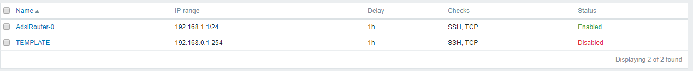

# ipDiscovery

This script has been developed to help fast Zabbix deploying, collecting SNMP data from network routers, and automatically creating discovery rules. It is also able to output csv and html reports.

## Description

Zabbix has a useful network discovery feature, but if you have to manually insert and keep updated thousands of network classes, this task gets a bit tricky.

This script tries to solve this issue. It will iterate over all hosts on a previously chosen Zabbix host group, preferably routers and/or firewalls, and will query the SNMP ipAddrTable [rfc1213-mib2.asn1](http://www.alvestrand.no/objectid/sources/rfc1213-mib2.asn1) .

All interaction with Zabbix is made through [PyZabbix](https://github.com/lukecyca/pyzabbix). You are able to configure including and excluding IP network ranges, those do not apply to the reporting options.

## Instalation

In a debian based system:

    apt-get install python-setuptools python-dev build-essential
    easy_install pip
    pip install --upgrade virtualenv
    pip install pyzabbix
    pip install ipaddress
    pip install pysnmp

## Configuration

The following parameters are in the beginning of the ipDiscovery.py script file. Configure the Zabbix user that will run the script. Ensure that it has enough rights to see the hosts and to create the discovery rules:

    user = "Admin"

The password for that user:

    secret = "zabbix"

The URL for the Zabbix API:

    zapi = ZabbixAPI("http://127.0.0.1/zabbix")

The SNMP community to access the devices:

    community = "public"

The name of the Zabbix host group to get the device information:

    routersGroupName="Router"
The name of the Zabbix discovery rule that will be used as a template to create the new ones:

    templateDiscoveryRule="TEMPLATE"

Only include IP networks that are in the specified range(s) below:

    includeIfInRange=["10.0.0.0/8","172.16.0.0/12","192.168.0.0/16"]

Do not include IP networks that are in the specified range(s) below. In case it matches both include and ignore rules, IP network is not included.

    ignoreIfInRange=["127.0.0.0/8"]

Some devices can have hundreds of interfaces, so you can break them in many rules. This attribute defines the maximum number of networks in each rule. You should not configure it to more than 112, or you might get into Zabbix maximum number of networks per rule restriction.

    maxNetPerRule = 10

## Usage

     ./ipDiscovery.py -h
    Usage: ipDiscovery.py [options]
    
    Options:
      -h, --help            show this help message and exit
      -t TYPE, --type=TYPE  output type: html, csv or api [default: html]
    
## ./ipDiscovery .py -t html

This will produce a [Ajax searchable DataTable](https://datatables.net/examples/data_sources/ajax.html) as this [example](files/table.html).

## ./ipDiscovery.py -t csv

This will produce a csv file like this:

    AdslRouter,1-lo,127.0.0.1/8
    AdslRouter,12-ppp0,179.181.19.234/32
    AdslRouter,4-br0,192.168.1.1/24

## ./ipDiscovery.py -t api

This will create the Zabbix discovery rules as configured above.

    > Written with [StackEdit](https://stackedit.io/). 

